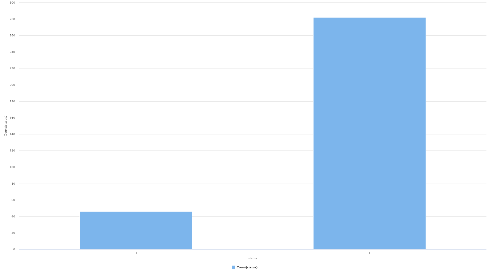
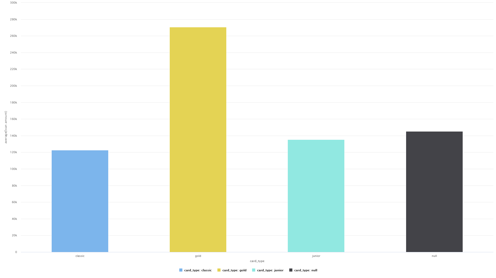
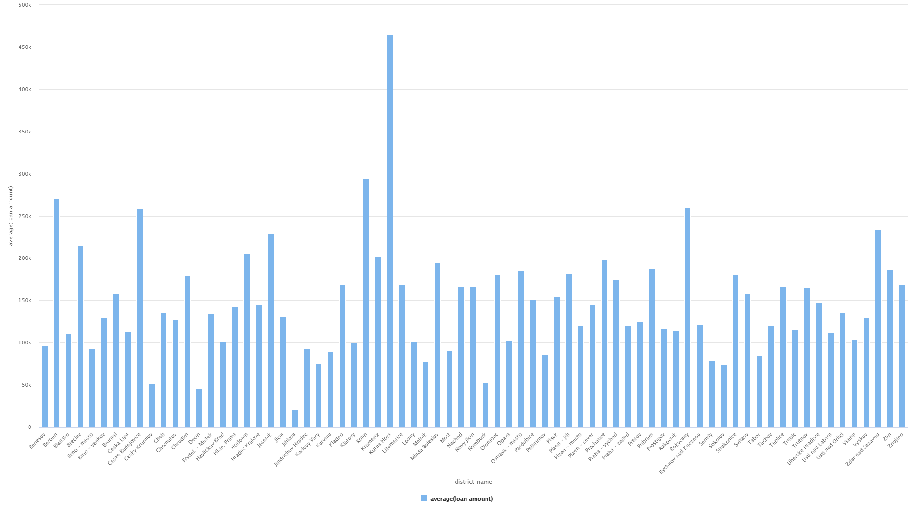
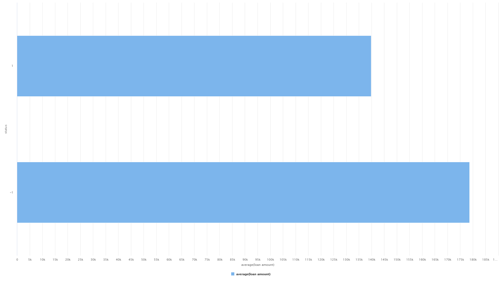
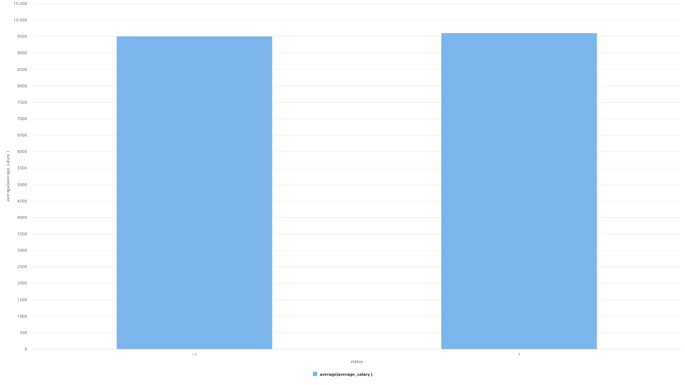
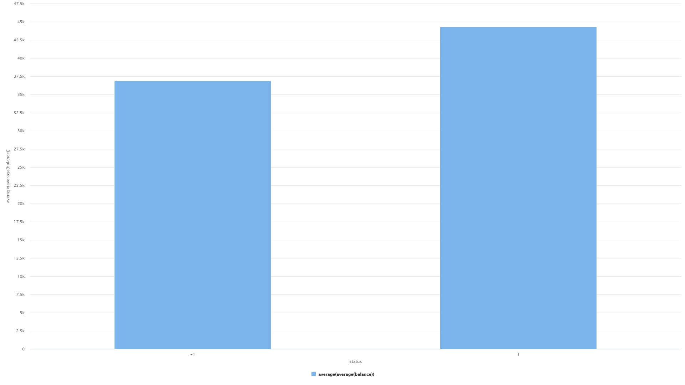
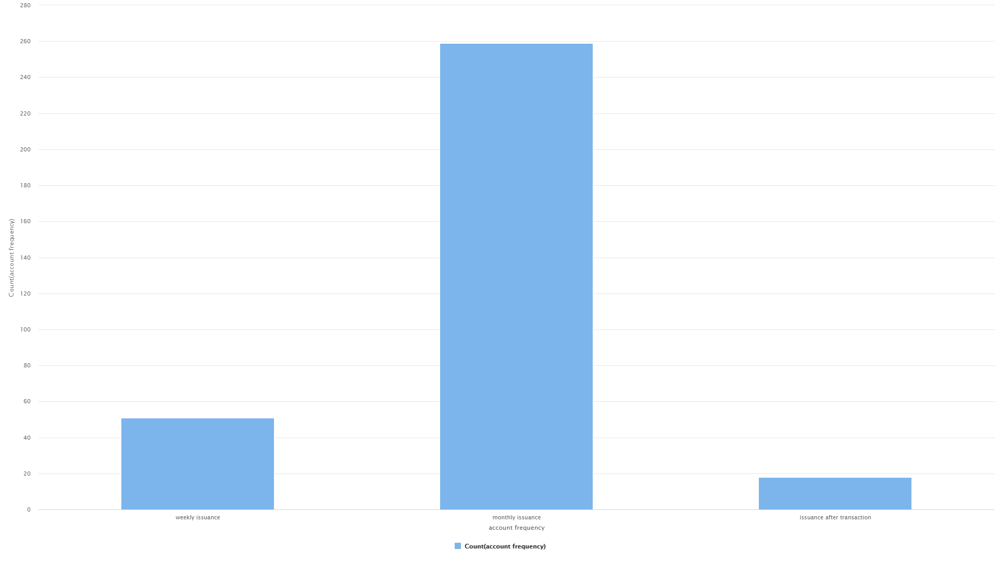
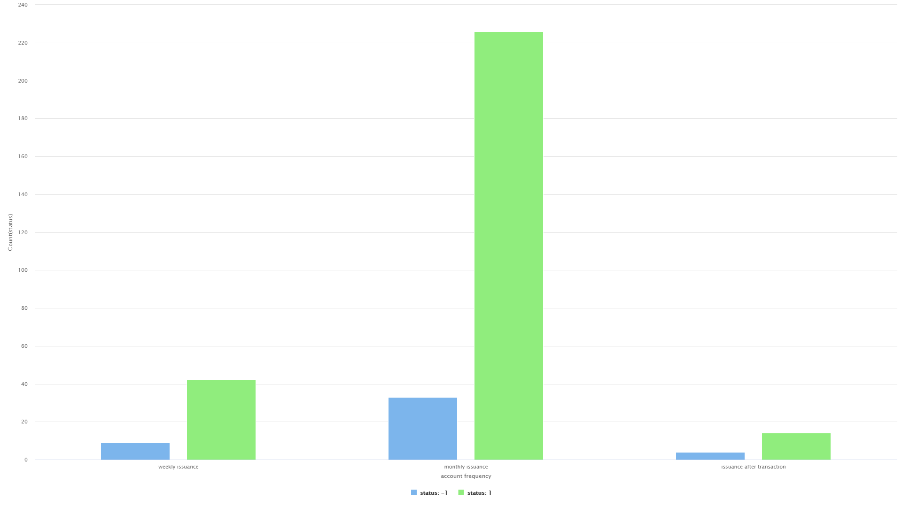
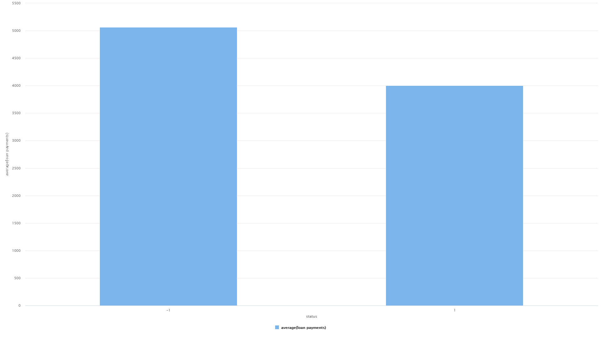

### The following data is calculated from the loans table joinned with others:

Quantidade de status para cada tipo(1 e -1):

Media da quantidade de loan por tipo de cartão:

Media da quantidade de loan por distrito (são muitos distristos portanto os nomes não aparecem todos):

Media da quantidade de loan por status (1 e -1):

Media do "Salario medio" por status (1 e -1):

Media do quantidada final que fica no banco (relation transaction-> balance) por status (1 e -1):

Quantidade de account frequency:

Quantidade de account frequency por status:

Media da quantidade de pagamentos por status:

